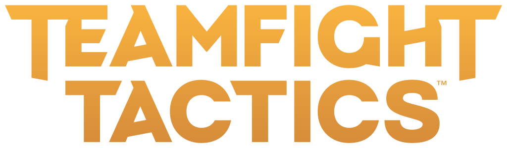
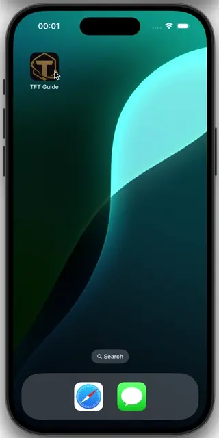

  

This project is a tool to help players of [Teamfight Tactics (TFT)](https://teamfighttactics.leagueoflegends.com/) learn
how items work, how to use them effectively, and how to combine them for optimal strategies.

You can explore the project through the following directories:

- [App](./app): Houses the source code for the Flutter application, which serves as the front-end
  interface for the guide.
- [Design](./design): Includes design files, assets, and guidelines to maintain a cohesive UI/UX for
  the app.
- [Infrastructure](./infrastructure): Contains database configurations.

# Demo

    <picture>
        <source media="(prefers-color-scheme: dark)" srcset="design/screenshots/dark/demo.webp">
        
    </picture>

For a closer look at the app's features and interface, you can find additional
screenshots [here](design/screenshots/).
