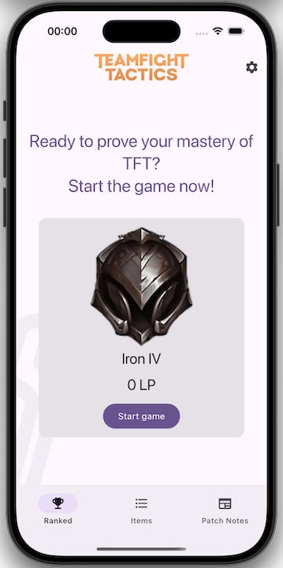
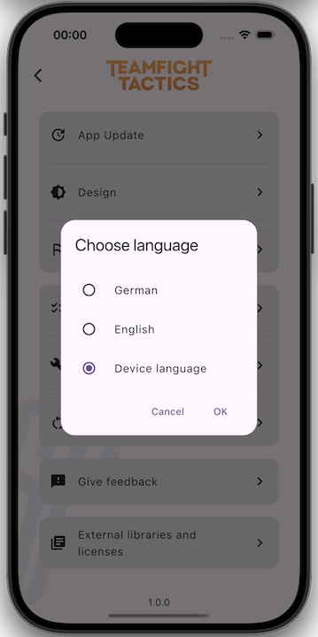
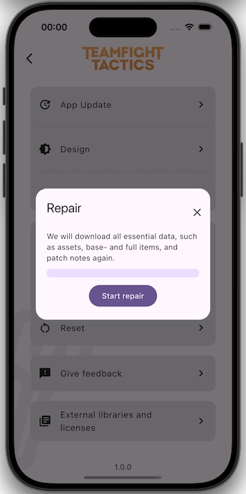
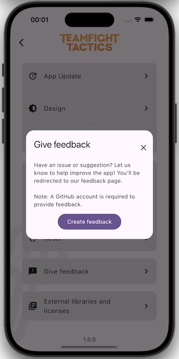
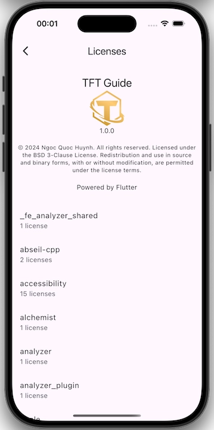

# Demo

    <picture>
        <source media="(prefers-color-scheme: dark)" srcset="./dark/demo.webp">
        
    </picture>

# Screenshots

|          <picture><source media="(prefers-color-scheme: dark)" srcset="./dark/splash_screen.webp"></picture>          |                 <picture><source media="(prefers-color-scheme: dark)" srcset="./dark/ranked.webp"></picture>                  |      <picture><source media="(prefers-color-scheme: dark)" srcset="./dark/game_selected.webp"></picture>      |     <picture><source media="(prefers-color-scheme: dark)" srcset="./dark/game_correct.webp"></picture>      |
|:---------------------------------------------------------------------------------------------------------------------------------------------------------------------------------:|:---------------------------------------------------------------------------------------------------------------------------------------------------------------------------:|:------------------------------------------------------------------------------------------------------------------------------------------------------------------------:|:---------------------------------------------------------------------------------------------------------------------------------------------------------------------:|
|                                                                                   Splash screen                                                                                   |                                                                                   Ranked                                                                                    |                                                                              Game selected                                                                               |                                                                             Game correct                                                                              |
|              <picture><source media="(prefers-color-scheme: dark)" srcset="./dark/game_wrong.webp"></picture>               |     <picture><source media="(prefers-color-scheme: dark)" srcset="./dark/ranked_elo_gain.webp"></picture>     |             <picture><source media="(prefers-color-scheme: dark)" srcset="./dark/settings.webp"></picture>             | <picture><source media="(prefers-color-scheme: dark)" srcset="./dark/settings_update.webp"></picture> |
|                                                                                    Game wrong                                                                                     |                                                                               Ranked elo gain                                                                               |                                                                                 Settings                                                                                 |                                                                            Settings update                                                                            |
|       <picture><source media="(prefers-color-scheme: dark)" srcset="./dark/settings_design.webp"></picture>       | <picture><source media="(prefers-color-scheme: dark)" srcset="./dark/settings_language.webp"></picture> |    <picture><source media="(prefers-color-scheme: dark)" srcset="./dark/settings_check.webp"></picture>    | <picture><source media="(prefers-color-scheme: dark)" srcset="./dark/settings_repair.webp"></picture> |
|                                                                                  Settings design                                                                                  |                                                                              Settings language                                                                              |                                                                              Settings check                                                                              |                                                                            Settings repair                                                                            |
|        <picture><source media="(prefers-color-scheme: dark)" srcset="./dark/settings_reset.webp"></picture>         | <picture><source media="(prefers-color-scheme: dark)" srcset="./dark/settings_feedback.webp"></picture> | <picture><source media="(prefers-color-scheme: dark)" srcset="./dark/settings_license.webp"></picture> |  <picture><source media="(prefers-color-scheme: dark)" srcset="./dark/settings_admin.webp"></picture>   |
|                                                                                  Settings reset                                                                                   |                                                                              Settings feedback                                                                              |                                                                             Settings license                                                                             |                                                                            Settings admin                                                                             |
| <picture><source media="(prefers-color-scheme: dark)" srcset="./dark/settings_update_elo.webp"></picture> |                   <picture><source media="(prefers-color-scheme: dark)" srcset="./dark/items.webp"></picture>                   |           <picture><source media="(prefers-color-scheme: dark)" srcset="./dark/base_item.webp"></picture>            |          <picture><source media="(prefers-color-scheme: dark)" srcset="./dark/full_item.webp"></picture>          |
|                                                                                Settings update elo                                                                                |                                                                                    Items                                                                                    |                                                                                Base item                                                                                 |                                                                               Full item                                                                               |
|             <picture><source media="(prefers-color-scheme: dark)" srcset="./dark/patch_notes.webp"></picture>             |
|                                                                                    Patch notes                                                                                    |

